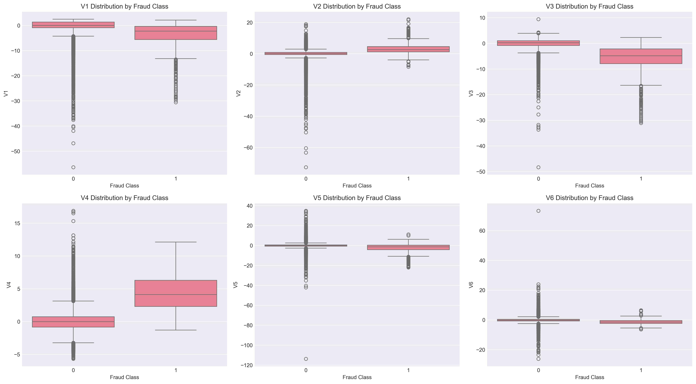
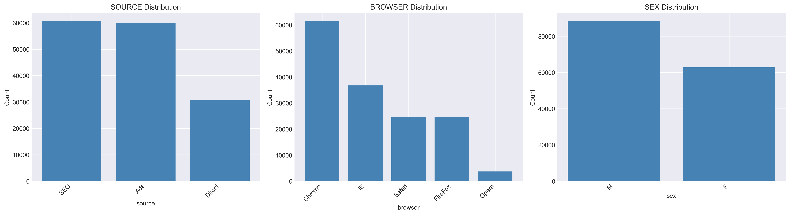

# Adey Fraud Detection System

A machine learning project for detecting fraud in e-commerce and bank credit card transactions. The system focuses on the main challenge in fraud detection: identifying rare fraud cases without creating too many false alarms for legitimate customers.

The project uses exploratory data analysis, feature engineering, class imbalance handling, model training, model comparison, and SHAP explainability.

## Objectives

- Analyze transaction patterns linked to fraud.
- Build features from time, amount, device, source, browser, and geolocation data.
- Train and compare Logistic Regression, Random Forest, and XGBoost models.
- Evaluate models with metrics that work well for imbalanced data.
- Explain model decisions using SHAP.

## What This Project Demonstrates

- End-to-end machine learning workflow from raw data to model evaluation.
- Practical handling of highly imbalanced fraud datasets.
- Feature engineering for time-based behavior, transaction frequency, and country-level risk.
- Model comparison using metrics that match the business problem.
- Explainable AI using SHAP to make model decisions easier to understand.
- Clean project structure with reusable source modules, notebooks, tests, and CI workflows.

## Data

Place all raw datasets in `data/raw/`.

| File | Description | Status |
| --- | --- | --- |
| `Fraud_Data.csv` | E-commerce transactions with user, device, time, amount, IP address, and fraud label. | Included locally |
| `IpAddress_to_Country.csv` | IP address ranges mapped to countries for geolocation features. | Included locally |
| `creditcard.csv` | Bank credit card transactions with `Time`, `Amount`, PCA features `V1` to `V28`, and `Class`. | Download separately |

Credit card dataset link: [Download `creditcard.csv`](https://drive.google.com/file/d/1fL281wTT2O4bjWrKEOl-zsWHHKk2QSvq/view?usp=sharing)

After downloading, save it as:

```text
data/raw/creditcard.csv
```

For both datasets, `1` means fraud and `0` means legitimate.

## Key Challenge

Fraud datasets are highly imbalanced. Most transactions are legitimate, so accuracy alone can be misleading. This project uses AUC-PR, precision, recall, F1-score, ROC-AUC, and confusion matrices to evaluate model performance more realistically.

The business goal is to reduce missed fraud cases while keeping false alerts low enough to protect customer experience.

## Sample Outputs

### Credit Card Transactions




### E-commerce Transactions





## Project Workflow

1. Load and validate the datasets.
2. Explore class balance, transaction amounts, time patterns, and categorical features.
3. Add time-based, transaction behavior, and country-risk features.
4. Split data using stratification.
5. Handle class imbalance with SMOTE or undersampling.
6. Train and compare models.
7. Interpret model behavior with SHAP.

## Tools and Libraries

- Python
- pandas and NumPy
- scikit-learn
- imbalanced-learn
- XGBoost
- SHAP
- matplotlib and seaborn
- pytest
- GitHub Actions

## Project Structure

```text
adey-fraud-detection-system/
├── data/
├── notebooks/
├── outputs/
├── scripts/
├── src/
├── tests/
├── requirements.txt
└── README.md
```

## Setup

```bash
python -m venv .venv
source .venv/bin/activate
python -m pip install --upgrade pip
python -m pip install -r requirements.txt
```

Optional Jupyter kernel:

```bash
python -m ipykernel install --user --name fraud-detection --display-name "Python (fraud-detection)"
```

## Running the Notebooks

Run the notebooks in this order:

1. `notebooks/data-overview.ipynb`
2. `notebooks/eda-fraud-data.ipynb`
3. `notebooks/eda-creditcard.ipynb`
4. `notebooks/feature-engineering.ipynb`
5. `notebooks/modeling.ipynb`
6. `notebooks/shap-explainability.ipynb`

Generated charts are saved in `outputs/eda/`.

## Tests

Run all tests:

```bash
python -m pytest -q
```

Run project checks:

```bash
python scripts/run_tests.py --unit
python scripts/run_tests.py --integration
python scripts/run_tests.py --quality
```

Current validation:

- 61 tests passing
- 96% source coverage
- Code quality checks passing
- Security checks passing

## Key Strengths

- Uses fraud-specific evaluation instead of relying only on accuracy.
- Includes both e-commerce and bank transaction fraud detection workflows.
- Adds geolocation features from IP address ranges.
- Keeps model code reusable through the `src/` modules.
- Includes automated tests for data loading, feature engineering, model training, and full pipeline behavior.
