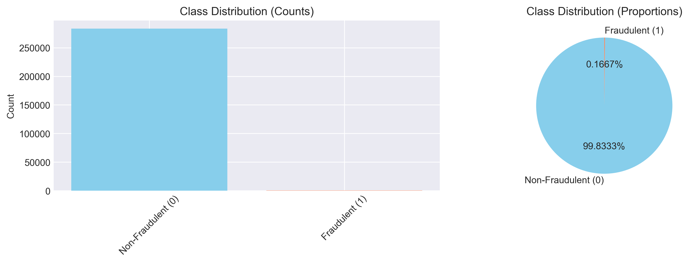
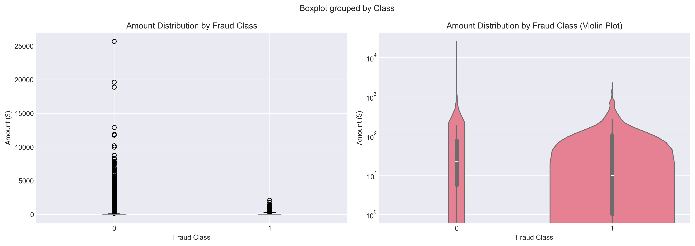
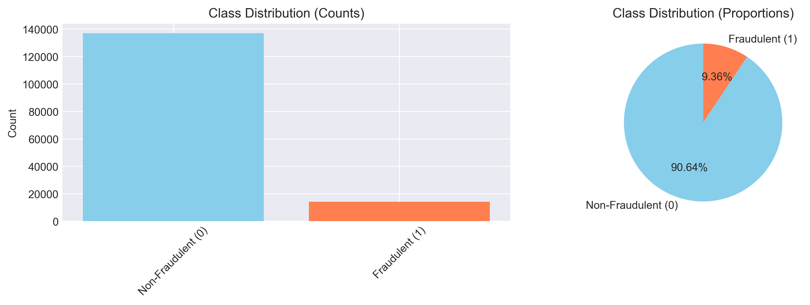
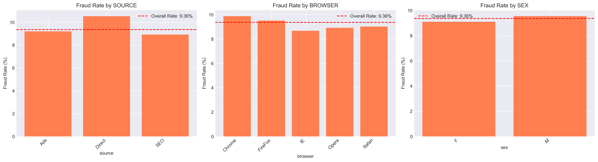

# Fraud Detection for E-commerce and Bank Transactions 🚨💳

## 📊 Key EDA Visualizations

> Here are some of the main project insights — see the `outputs/eda/` folders for more details.

### Credit Card Fraud Data

- **Class Imbalance**  
    
  _(Very few transactions are fraudulent! Solving this imbalance is critical.)_ 🟦🟥

- **Transaction Amount by Fraud Class**  
    
  _(Fraud amounts can have a different distribution from non-fraud. Look for outliers!)_ 💸

- **Top Feature Correlations**  
    
  _(Identify which features most separate fraud from legit transactions.)_ 📈

---

### E-commerce Fraud Data

- **Class Imbalance**  
    
  _(Most transactions are genuine. Imbalance must be handled in modeling.)_ 🟩🟥

- **Fraud by Country**  
    
  _(Some countries have higher fraud rates. Geolocation patterns can reveal threats.)_ 🌍

- **Fraud by Categorical Feature (e.g., Source/Browser)**  
    
  _(Certain browser, device, or source channels may be riskier!)_ 🕵️‍♂️

---

## 📝 What’s this?
This repo helps **detect fraud** in e-commerce and banking using machine learning and exploratory data analysis.  
- Handles data imbalance  
- Builds & explains predictive models  
- Uses geolocation, time, amount, and user patterns to spot fraud

---

## 🚀 Instructions

1. 📂 Place data in `data/raw/`
2. ▶️ Run notebooks in order (EDA → Feature Engineering → Modeling)
3. 🖼️ See all saved plots in `outputs/eda/creditcard/` and `outputs/eda/fraud-data/`

---

